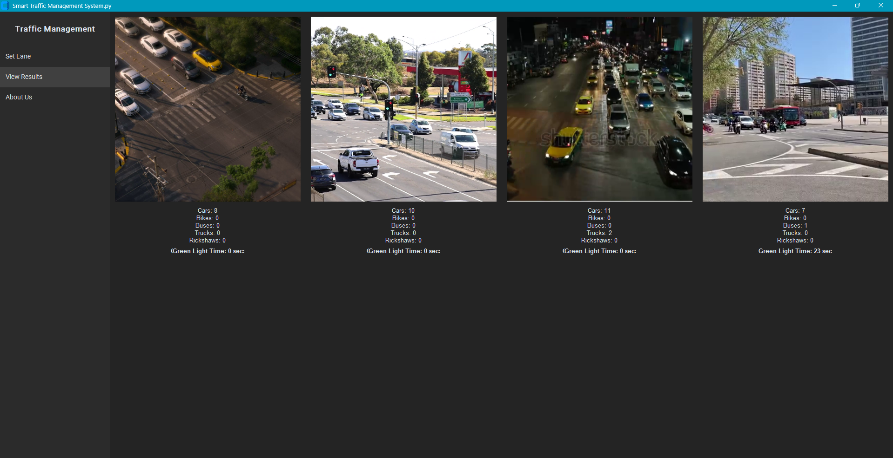

# 🚦 AI-Powered Smart Traffic Management System

An intelligent and scalable traffic control solution that harnesses the power of **Artificial Intelligence (AI)** and **Computer Vision** to optimize real-time traffic flow. Using **YOLOv8** object detection and **custom UI controls**, this system detects and classifies vehicles from live video feeds and adjusts signal timings dynamically based on vehicle density and type.

Built to address the ever-growing traffic challenges in urban environments, this system offers a practical AI-driven alternative to traditional, static traffic systems. 🌆🚗

---

## 🔧 Key Features

✨ The project includes the following major features:

- 🎯 **Real-Time Vehicle Detection:** Utilizes YOLOv8 to detect and classify vehicles such as cars, buses, trucks, and two-wheelers with high accuracy.
  
- 📹 **Multi-Lane Support:** Processes video input from **four different lanes simultaneously**, enabling accurate traffic analysis at busy intersections.

- 🚦 **Dynamic Signal Timing:** Adjusts green light durations based on the density and type of vehicles in each lane — improving traffic efficiency and reducing wait times.

- 🖱️ **Custom GUI (Tkinter):** User-friendly **customtkinter** interface for selecting regions of interest (ROI) in video feeds — essential for accurate vehicle detection in specific areas.

- ⚡ **Optimized Performance:** Ensures real-time speed and smooth detection, even with multiple live video streams.

- 🧠 **AI for Smart Cities:** Demonstrates how AI technologies can be integrated into city infrastructure for automation, efficiency, and better urban living.

---

## 🛠️ Tech Stack

Here’s a breakdown of the technologies used:

- 🐍 **Python** – Primary programming language
- 🔍 **YOLOv8** – Object detection model (Ultralytics)
- 🎥 **OpenCV** – Real-time image processing and video handling
- 🪟 **customtkinter** – Modern GUI framework based on Tkinter for creating a clean user interface
- 📊 **NumPy** – Efficient numerical computation and array operations

---

## 📷 Screenshots

Below is a sample output from the project interface:



---

## 🚀 Getting Started

To run the project locally, follow the steps below:

### 🔄 Prerequisites
Make sure you have Python 3.8+ installed and `pip`.

### 1. Clone the repository

```bash
git clone https://github.com/Nandhu3055/AI-Powered-Smart-Traffic-Management-System.git
```

### 2. Navigate to the project folder

```bash
cd AI-Powered-Smart-Traffic-Management-System
```

### 3. Run the main script

```bash
python traffic.py
```

---

## 💡 Future Scope

🚧 This project can be extended further with the following features:

- 🚶 **Pedestrian Detection:** Add the ability to detect and manage pedestrian crossings.
- 📡 **Hardware Integration:** Connect with actual traffic lights and IoT sensors.
- 📊 **Analytics Dashboard:** Store and visualize traffic trends using charts and graphs.
- ☁️ **Cloud Integration:** Stream data to cloud for central monitoring and control.

---

## 👨‍💻 Author

- **Nandhitha M**  
  📍 Passionate about AI, Smart Systems, and solving real-world problems with code.  
  🔗 [LinkedIn](https://www.linkedin.com/in/nandhitha-madhavan/)
